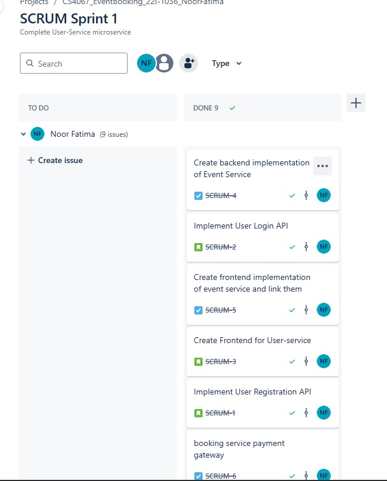

# Event Booking Platform (Microservices Architecture)

## Overview
This project is a **Microservices-based Online Event Booking Platform** that enables users to **view, book, and receive notifications** for events. It consists of four microservices:

1. **User Service** (FastAPI, PostgreSQL) - Manages user registration, authentication, and login.
2. **Event Service** (Spring Boot, MongoDB Atlas) - Handles event creation, retrieval, and management.
3. **Booking Service** (Flask, PostgreSQL) - Processes event bookings, manages event capacity, and handles payments.
4. **Notification Service** (Flask, MongoDB) - Sends booking notifications asynchronously using RabbitMQ.

---

## Architecture
### **Microservices Communication**
- **User Service → Event Service** *(Synchronous, REST API)*
- **Booking Service → Event Service** *(Synchronous, REST API)*
- **Booking Service → Notification Service** *(Asynchronous, RabbitMQ)*
- **Notification Service → MongoDB** *(Storing notifications for users)*

### **Technology Stack**
| Service             | Framework & DB |
|--------------------|--------------|
| **User Service**   | FastAPI + PostgreSQL |
| **Event Service**  | Spring Boot + MongoDB Atlas |
| **Booking Service**| Flask + PostgreSQL |
| **Notification**   | Flask + MongoDB + RabbitMQ |
| **Frontend**       | HTML/CSS/JavaScript |

---

## Setup Instructions
### **1. Clone the Repository**
```sh
git clone https://github.com/yourusername/eventbooking.git
cd eventbooking
```

### **2. Start Services Individually**
#### **User Service (FastAPI)**
```sh
cd user-service
uvicorn app.main:app --host 0.0.0.0 --port 8000 --reload
```

#### **Event Service (Spring Boot)**
```sh
cd event-service
mvn clean install
mvn spring-boot:run
```

#### **Booking Service (Flask)**
```sh
cd booking-service
python -m venv venv
source venv/bin/activate  # On Windows use: venv\Scripts\activate
pip install -r requirements.txt
python app.py
```

#### **Notification Service (Flask + RabbitMQ)**
```sh
cd notification-service
pip install -r requirements.txt
python notification_service.py
```

---

## API Endpoints

### **User Service (FastAPI)**
| Method | Endpoint             | Description            |
|--------|----------------------|------------------------|
| `POST` | `/users/register`    | Register a new user   |
| `POST` | `/users/login`       | User login (JWT auth) |
| `GET`  | `/users/events`      | Fetch available events |

### **Event Service (Spring Boot)**
| Method | Endpoint        | Description |
|--------|---------------|-------------|
| `GET`  | `/api/events`  | Fetch all events |
| `POST` | `/api/events`  | Create a new event |
| `GET`  | `/api/events/{id}` | Get event by ID |

### **Booking Service (Flask)**
| Method | Endpoint                     | Description |
|--------|------------------------------|-------------|
| `POST` | `/bookings`                   | Book an event (Checks event capacity before confirming) |
| `GET`  | `/bookings/{id}`               | Get booking details |
| `POST` | `/payments`                    | Process a payment for a booking |
| `PUT`  | `/api/events/{event_id}/decrease_capacity` | Decrease event capacity upon booking |

**Booking Flow:**
1. **User selects an event** → Booking request sent to Booking Service.
2. **Booking Service validates availability** by checking event capacity from **Event Service**.
3. **Capacity is updated** in Event Service after successful booking.
4. **Payment is processed** (Mock payment gateway in Booking Service).
5. **Notification Service** receives the booking confirmation via **RabbitMQ**.

### **Notification Service (Flask + RabbitMQ)**
| Method | Endpoint           | Description |
|--------|------------------|-------------|
| `GET`  | `/notifications/{user_id}` | Get user notifications |

---

## Database Schema

### **Booking Service (PostgreSQL)**
**Table: `bookings`**
| Column         | Type          | Description |
|---------------|--------------|-------------|
| `id`          | `INTEGER` (PK) | Unique Booking ID |
| `user_id`     | `INTEGER`     | ID of the user who booked |
| `event_id`    | `TEXT`        | Associated event ID |
| `status`      | `TEXT`        | Status (Pending/Confirmed) |
| `payment_status` | `TEXT`    | Payment Status (Paid/Failed) |
| `created_at`  | `TIMESTAMP`   | Booking timestamp |

---

## Frontend

- Built with **HTML, CSS, JavaScript**.
- **Event Service Frontend** allows users to **view events and create events**.
- **Booking Service Frontend** allows users to **book events and process payments**.

---

## Features & Enhancements
-  **Microservices architecture** with RESTful communication.
-  **RabbitMQ for async notifications**.
-  **JWT-based authentication for User Service**.
-  **Event capacity management** (reduces event slots on booking).
-  **Mock payment gateway for bookings**.
-  **Future Enhancements**:
  - Integrate **actual payment gateway** (e.g., Stripe, PayPal).
  - Implement **admin dashboard** for event organizers.

---

## Jira 

